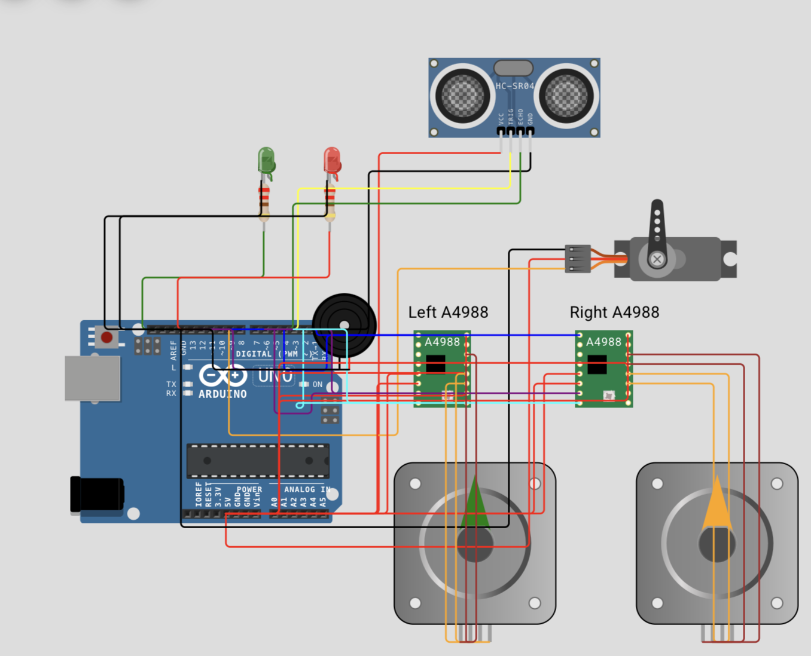

# Arduino Smart Car

Проект Wokwi: https://wokwi.com/projects/465111078896840705

## Запуск

1. Открыть ссылку на проект Wokwi.
2. Проверить, что в проекте есть файлы:
   - `sketch.ino`
   - `diagram.json`
3. Нажать зелёную кнопку **Start Simulation**.
4. Открыть **Serial Monitor**.
5. Нажать на датчик **HC-SR04** и менять расстояние ползунком.

## Проверка

- Расстояние больше `35 cm`: робот едет вперёд, горит зелёный LED.
- Расстояние меньше `25 cm`: робот сканирует стороны, мигает красный LED, работает зуммер.
- В Serial Monitor выводятся расстояния и текущий режим.

## Для код-ревью

Проверять в таком порядке:

1. `diagram.json`:
   - есть Arduino UNO, HC-SR04, Servo, два A4988, два stepper motor;
   - у LED стоят резисторы `220 Ом`;
   - пины совпадают с константами в `sketch.ino`.

2. `sketch.ino`:
   - все пины, пороги и периоды вынесены в `const`;
   - основной цикл не использует `delay()`;
   - периодические действия сделаны через `millis()` / `micros()`;
   - логика режимов оформлена как конечный автомат `RobotMode`;
   - для препятствия есть гистерезис `25 cm` / `35 cm`;
   - Serial Monitor обновляется раз в `500 ms`.

3. Поведение в Wokwi:
   - при дистанции больше `35 cm` оба мотора вращаются вперёд;
   - при дистанции меньше `25 cm` робот останавливается, сканирует стороны и поворачивает;
   - красный LED и зуммер активны только в режиме обхода.

## Замена драйвера

В Wokwi вместо L298N используются два A4988 и два шаговых двигателя. Это сделано потому, что L298N не является штатным компонентом Wokwi и может отображаться как `Missing chip`. A4988 сохраняет смысл motor driver: Arduino управляет моторами через отдельный драйвер, а не напрямую.

## Локальные файлы

- `sketch.ino` — код Arduino.
- `diagram.json` — схема Wokwi.
